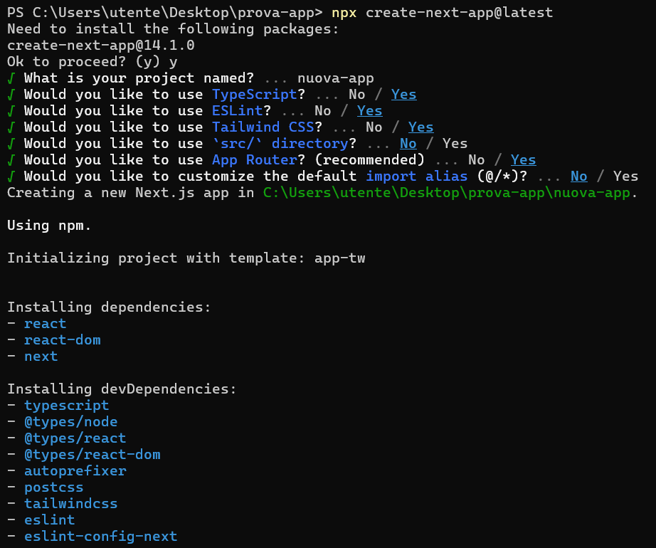
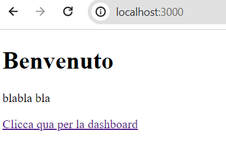
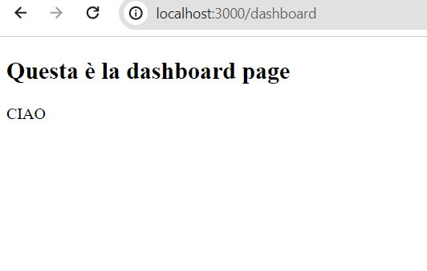

# CHANGE LOG
## CREAZIONE APP WEB
Per la creazione di un'app web, sono stati seguiti i seguenti passaggi:
- È stata creata una cartella dentro alla quale metterò la nuova applicazione web.
- Da prompt dei comandi, mi sono posizionato nella nuova cartella e ho utlizzato il seguente comando:

    ```sh
    npx create-next-app@latest
    ```
- Successivamente, ho dovuto compilare diversi campi per la creazione dell'app:

- Una volta che l'applicazione era presente sul mio computer, ho creato diversi file al suo interno, tra cui:
    - `page.tsx`: utilizzata per la home page dell'applicazione web. Ho scritto il seguente codice:
        ```sh
        import { Metadata } from 'next'
        import Link from 'next/link'

        export const metadata: Metadata = {
            title: 'Next.js',
        }

        export default function Page() {
            return (
                <div>
                <h1>Benvenuto</h1>
                <p>blabla bla</p>
                <Link href="/dashboard">Clicca qua per la dashboard</Link>
                </div>
            );
        }
        ```
    - `layout.tsx`: utilizzata per il layout e la struttura della pagina. Ho scritto il seguente codice:
        ```sh
        export const metadata = {
        title: 'Next.js',
        description: 'Generated by Next.js',
        }

        export default function RootLayout({
            children,
        }: {
            children: React.ReactNode
        }) {
            return (
                <html lang="it">
                <body>
                    <main>{children}</main>
                </body>
                </html>
            )
        }
        ```
    - `template.tsx`: è un file che determina elementi comuni in tutte le pagine dell'app web. Un esempio può essere il footer o la barra delle impostazioni. Ho scritto il seguente codice:

        ```sh
        export default function Template({ children }: { children: React.ReactNode }) {
        return <div>{children}</div>
        }
        ```
- Successivamente, ho anche creato una sottocartella `dashboard`, dove al suo interno ho creato una seconda pagina web che dipendesse da quella principale.
- All'interno della dashboard ho inserito i seguenti file:
    - `page.tsx`: file necessario per inserire elementi nella seconda pagina. Ho scritto il seguente codice:

        ```sh
            export default function Page() {
            return (
                <div>
                <h1>Questa è la dashboard page</h1>
                <p>CIAO</p>  
                </div>        
            )
        }
        ```
    - `layout.tsx`: serviva per il layout della seconda pagina. È stato scritto il seguente codice:
        ```sh
        export default function DashboardLayout({
            children,
        }: {
            children: React.ReactNode
        }) {
            return (
                <section>
                {children}
                <nav></nav>        
                {children}
            </section>
            )
        }
        ```
- `loading.tsx`: file necessario per garantire una migliore interfaccia utente in caso di tempi prolungati di caricamento di dati. Non è stato completato del tutto, ma è stato scritto il seguente codice:
    ```sh
    export default function Loading() {
        return <p>Loading...</p>
    }
    ```
- Ora, per vedere la pagina web, è necessario prima aprire il prompt nella cartella dell'applicazione e digitare il seguente comando:
    ```sh
    npm run dev
    ```
- Se l'operazione è andata a buonfine, basta andare sul link http://localhost:3000 e vedere se le due pagine sono presenti.

    

    

## AGGIUNTA PULSANTI E ERRORE
- Ho aggiunto in `page.tsx` un pulsante per raggiungere più facilmente la dashboard:
    ```sh
    <button type="button"  onClick={() => router.push('/dashboard')}>clicca per dashboard</button>
    ```
- Ho modificato il contenuto di `layout.tsx` e ccreato una nuova iterfaccia `IRootLayout` per semplificare la lettura del codice:

    ```sh
    interface IRootLayout{
        children : React.ReactNode
    }

    export default function RootLayout(props : IRootLayout) {
        return (
            <html lang="it">
            <body>
                <main>{props.children}</main>
            </body>
            </html>
        )
    }
    ```
- All'interno di `dashboard`, ho creato un nuovo file chiamato `error.tsx` che serve per la gestione degli errori:
    ```sh
    'use client'
    export default function Error({
        error,
        reset,
    }: {
        error: Error & { digest?: string }
        reset: () => void
    }) {
        return (
            <div>
            <h2>Something went wrong!</h2>
            <button onClick={() => reset()}>Try again</button>
            </div>
        )
    }
    ```
- Dentro a `page.tsx` ho creato una funzione asincrona per la cattura dei dati. I dati vengono registrati ogni ora.
    ```sh
    async function getData() {
    const res = await fetch('https://jsonplaceholder.typicode.com/todos', { next: { revalidate: 3600 } })
     if (!res.ok) {
        throw new Error('Errore. Dati non presi.')
    }
 
    return res.json()
    }
    ```

## AGGIUNTA STILE
- Per cambiare lo stile all'interno della dashboard, ho creato un nuovo file chiamato `styles.module.css`. Al suo interno si possono scrivere diversi elementi di stile da applicare alla pagina, ma ho solamente cambiato il `padding` utilizzando il seguente codice:
    ```sh
    .dashboard {
        padding: 24px;
    }
    ```
- Successivamente, all'interno di `dashboard/layout.tsx` ho cambiato il codice precedente per far sì che potesse utilizzare le caratteristiche di `styles.module.css` presente nella stessa cartella.
    ```sh
    import styles from './styles.module.css'
    
    export default function DashboardLayout({
    children,
    }: {
    children: React.ReactNode
    }) {
    return <section className={styles.dashboard}>{children}</section>
    }
    ```